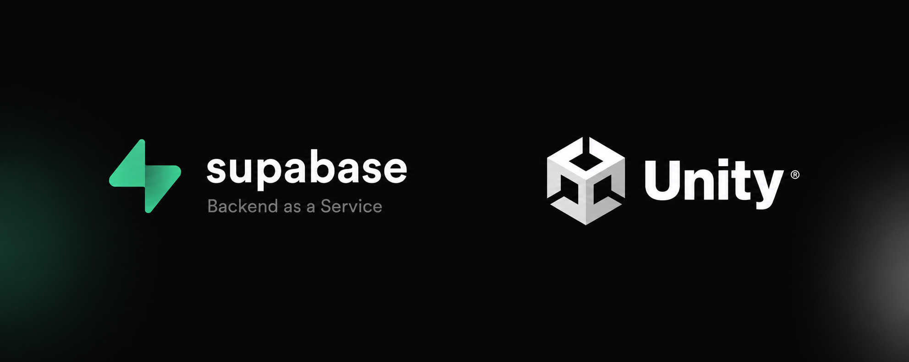

<p align="center">
  
</p>

<h1 align="center">Supabase for Unity</h1>

<p align="center">
  🎮 <strong>Auth, Database, Realtime, Storage, and Edge Functions for Unity.</strong><br />
  🌐 One package for WebGL, desktop, and mobile.
</p>

<p align="center">
  <a href="https://github.com/DorukTan/unity-supabase/releases/tag/v0.2.0-beta.2"></a>
  <a href="https://openupm.com/packages/com.supabaseunity.client/"></a>
  <a href="https://github.com/DorukTan/unity-supabase/actions/workflows/package-checks.yml"></a>
  
  <a href="LICENSE.md"></a>
</p>

<p align="center">
  <strong>
    <a href="#-get-started-in-5-minutes">🚀 Get started</a> ·
    <a href="Packages/com.supabaseunity.client/Documentation~/index.md">📚 Documentation</a> ·
    <a href="Packages/com.supabaseunity.client/CHANGELOG.md">📝 Changelog</a> ·
    <a href="CONTRIBUTING.md">🤝 Contributing</a>
  </strong>
</p>

> [!IMPORTANT]
> 🚧 **Supabase for Unity is currently in beta.** The API may change before 1.0. Breaking
> changes are documented in the [changelog](Packages/com.supabaseunity.client/CHANGELOG.md).

**Independent. Open source. Community-first.** Built with Unity developers, for Unity
developers. Not affiliated with or endorsed by Supabase, Inc. or Unity Technologies.

---

## 🎮 Why Supabase for Unity?

Supabase is a great game backend. Unity just needs a client built around **Unity's runtime**,
not a general-purpose .NET environment.

This package keeps the platform plumbing out of your game code:

- 🌍 **Runs across platforms** — WebGL, desktop, and mobile.
- 🧰 **Feels at home in Unity** — `UnityWebRequest`, async APIs, and a coroutine bridge.
- 🔌 **Uses the right transport** — browser bridges on WebGL, native WebSockets elsewhere.
- 🪶 **Stays lightweight** — no dependency on the official Supabase .NET client.

---

## ✨ Everything you need

| Module | What it gives you | Status |
| --- | --- | --- |
| 🔑 **Auth** | Password, OTP, anonymous, OAuth/PKCE, SSO, MFA, recovery, and sessions | 🧪 Beta |
| 🗄️ **Database** | Typed queries, filters, relationships, pagination, CRUD, counts, CSV, and RPC | 🧪 Beta |
| ⚡ **Realtime** | Postgres Changes, Broadcast, Presence, reconnects, and channel rejoin | 🧪 Beta |
| 📦 **Storage** | Upload, download, progress, listing, move, copy, transforms, and signed URLs | 🧪 Beta |
| 🚀 **Functions** | Typed or raw Edge Function calls with custom requests and timeouts | 🧪 Beta |
| 🛠️ **Editor tools** | Settings, credential checks, and OpenAPI model generation | 🧪 Beta |

> **Why is everything Beta?** The public API is not frozen yet. The goal for 1.0 is a stable
> surface Unity projects can rely on for the long term.

---

## 🚀 Get started in 5 minutes

**You need:** Unity 2021.3+ and a Supabase project.

### 1️⃣ Install the package

In Unity, open **Window > Package Manager**, choose **Add package from git URL**, and paste:

```text
https://github.com/DorukTan/unity-supabase.git?path=/Packages/com.supabaseunity.client#v0.2.0-beta.2
```

✅ **Done.** Newtonsoft Json.NET comes with it automatically.

Prefer a file download? The
[latest release](https://github.com/DorukTan/unity-supabase/releases/tag/v0.2.0-beta.2)
also includes:

- 📦 A `.unitypackage` for **Assets > Import Package > Custom Package**.
- 📦 A `.tgz` for **Package Manager > Add package from tarball**.

Install `com.unity.nuget.newtonsoft-json` first when using the `.unitypackage`. Do not install
both distributions in the same project; they contain the same assemblies.

### 2️⃣ Create your settings

Choose **Create > Supabase > Settings**, then enter:

1. 🌐 **Project URL**
2. 🔑 **Publishable key** (`sb_publishable_...`) or legacy `anon` key
3. 🗂️ **Data API schema** — normally `public`

Assign the settings asset to the component that starts your Supabase client.

> [!CAUTION]
> 🔐 **A Unity build is a public client.** Never include an `sb_secret_...` key, `service_role`
> key, database password, or management token in your project. Use Row Level Security and
> Storage policies to control what players can access.

### 3️⃣ Make your first query

```csharp
using System;
using Supabase.Unity;
using UnityEngine;

public sealed class Leaderboard : MonoBehaviour
{
    [SerializeField] private SupabaseSettings settings;
    private SupabaseClient supabase;

    private async void Start()
    {
        supabase = new SupabaseClient(settings);

        var initialized = await supabase.InitializeAsync();
        if (!initialized.IsSuccess)
        {
            Debug.LogError(initialized.Error);
            return;
        }

        var scores = await supabase.From<ScoreRow>()
            .Select("id,player_name,score")
            .Order("score", ascending: false)
            .Limit(10)
            .GetAsync();

        if (scores.IsSuccess)
            Debug.Log($"Loaded {scores.Data.Count} scores.");
        else
            Debug.LogError(scores.Error);
    }

    private void OnDestroy()
    {
        supabase?.Dispose();
    }
}

[Serializable, SupabaseTable("scores")]
public sealed class ScoreRow
{
    [SupabaseColumn("id")]
    public long Id { get; set; }

    [SupabaseColumn("player_name")]
    public string PlayerName { get; set; }

    [SupabaseColumn("score")]
    public int Score { get; set; }
}
```

> [!TIP]
> ✅ Every network call returns `SupabaseResult` or `SupabaseResult<T>`. Check `IsSuccess`,
> then read `Data` or `Error`. Cancellation still throws `OperationCanceledException`.

> [!WARNING]
> 🧊 **Keep network code asynchronous.** Calling `.Result` or `.GetAwaiter().GetResult()` can
> freeze Unity because the transport needs the main thread to continue running.

🎁 **Want a working scene?** Import the **Quickstart** sample from Package Manager, attach it
to a GameObject, assign your settings, and press Play.

---

## 🧩 One client. Five services.

Create one `SupabaseClient`, then use the service you need:

```csharp
supabase.Auth;                    // Sign-in, sessions, OAuth, and MFA
supabase.From<ScoreRow>();        // Typed database queries
supabase.Realtime.Channel("game"); // Postgres Changes, Broadcast, and Presence
supabase.Storage.From("avatars");  // Files and image transforms
supabase.Functions;               // Edge Functions
```

**That is the whole mental model.** For complete examples, see the
[API guide](Packages/com.supabaseunity.client/Documentation~/api.md).

---

## 🖥️ Platform support

**Supported** = built and run. **Untested** = compiles, but still needs a real-world report.

| Target | Status | Last checked by |
| --- | --- | --- |
| Unity 6 (6000.4.8f1) Editor | ✅ Supported | Maintainer |
| Unity 2022.3 LTS Editor | ✅ Supported | Maintainer |
| Unity 2021.3 LTS Editor | ✅ Supported | Maintainer |
| WebGL | ✅ Supported | Maintainer |
| Windows player | ✅ Supported | Maintainer |
| macOS player | ✅ Supported | Maintainer |
| Android | ✅ Supported | Maintainer |
| iOS | ✅ Supported | Maintainer |
| Linux player | ❓ Untested | Community report wanted |
| Consoles | ❌ Unsupported | — |

### ✅ Release checks

- **41 EditMode tests** before each release.
- **Credential scanning** across package contents.
- **Package validation** for GUIDs, versions, release files, and GitHub Actions.

📣 **Shipped a build?** Please file a
[platform report](https://github.com/DorukTan/unity-supabase/issues/new?template=platform_report.yml).
Reports from older OS versions, unusual devices, and aggressive stripping setups are gold.

---

## 🔐 Security by default

The package makes common credential mistakes harder:

- 🚫 **Elevated keys are rejected** in settings, headers, sessions, and player builds.
- 🔒 **HTTPS and WSS are required** outside local development.
- 🧼 **Tokens and keys are scrubbed** from SDK error messages.
- ↪️ **Credentialed redirects are disabled.**
- 🌐 **WebGL OAuth credentials are removed** from the URL after processing.

> [!WARNING]
> 🛡️ These protections do not replace database grants, Row Level Security, Storage policies,
> or Edge Function authorization. Those are still part of your application.

💾 **Session persistence is off by default.** Before enabling it, read the
[session storage guide](Packages/com.supabaseunity.client/Documentation~/session-storage.md)
and understand how refresh tokens are stored on each platform.

🐛 **Found a vulnerability?** Read the
[security guide](Packages/com.supabaseunity.client/Documentation~/security.md), then use
[private reporting](https://github.com/DorukTan/unity-supabase/security/advisories/new) instead
of opening a public issue.

---

## 📚 Pick a guide

- 🚀 [**Getting started**](Packages/com.supabaseunity.client/Documentation~/getting-started.md)
- 🧑‍💻 [**API guide**](Packages/com.supabaseunity.client/Documentation~/api.md)
- 📱 [**Platform notes**](Packages/com.supabaseunity.client/Documentation~/platforms.md)
- 💾 [**Session storage**](Packages/com.supabaseunity.client/Documentation~/session-storage.md)
- 🛡️ [**Security model**](Packages/com.supabaseunity.client/Documentation~/security.md)
- 🔀 [**Migrating to 0.2**](Packages/com.supabaseunity.client/Documentation~/migration-0.2.md)
- 💬 [**Support policy**](SUPPORT.md)
- 🇹🇷 [**Türkçe hızlı başlangıç**](Packages/com.supabaseunity.client/README.tr.md)
- 📝 [**Changelog**](Packages/com.supabaseunity.client/CHANGELOG.md)

---

## 🤝 Built with the community

Maintained by one developer in their spare time — strengthened by everyone who tests it,
reports problems, improves the docs, and contributes fixes.

**You do not need to build a huge feature to help:**

- 🖥️ **Share a platform report.**
- 🐛 **Create a small bug reproduction.**
- ✍️ **Fix confusing docs or add an example.**
- 📱 **Test on hardware the maintainer does not own.**
- 🔧 **Open a focused pull request.**

💬 Start with [**CONTRIBUTING.md**](CONTRIBUTING.md). Use
[**GitHub issues**](https://github.com/DorukTan/unity-supabase/issues) for support so every
answer remains searchable for the next developer.

---

## 💚 Free and open source

- 💰 **Use it in commercial games.**
- 🏠 **Connect it to self-hosted Supabase.**
- 🔧 **Fork it and make it yours.**
- 🚫 **No paid tier, CCU fees, telemetry, or hosted-service lock-in.**

**MIT licensed. The code you install is the product.**

---

## 📄 License & trademarks

Licensed under the [MIT License](LICENSE.md).

Supabase and the Supabase logo are trademarks of Supabase, Inc. Unity and the Unity logo are
trademarks or registered trademarks of Unity Technologies. Their appearance identifies
compatibility only and does not imply sponsorship or endorsement.
